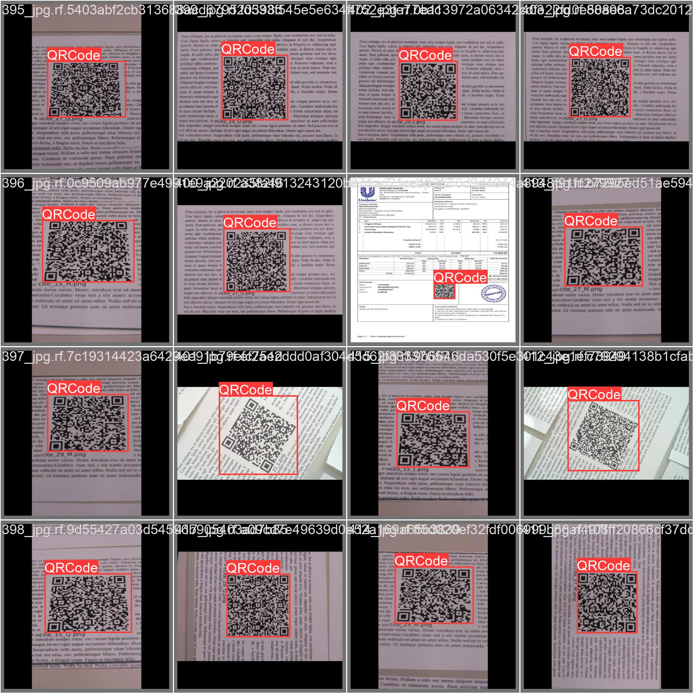
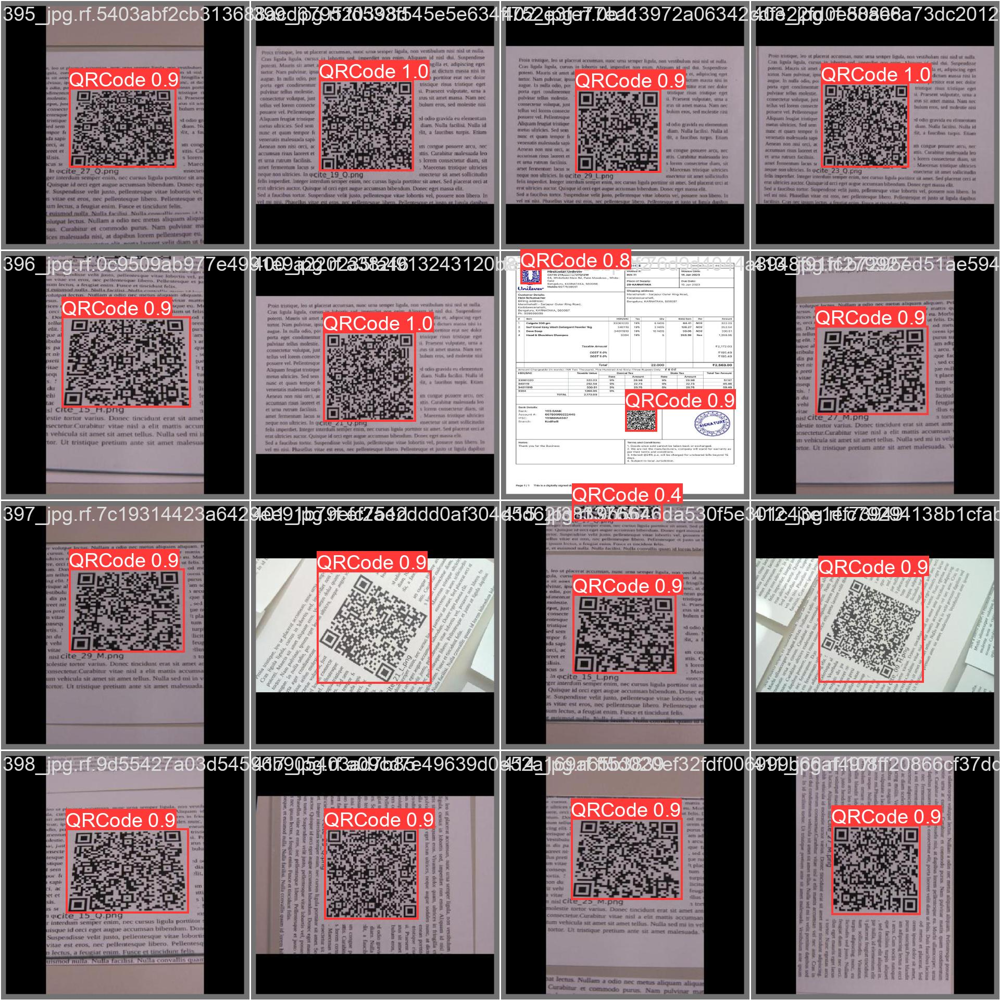

# QRCode_yolov5: End-to-End QR Code Detection and Decoding from PDFs

## Overview
This project provides a complete pipeline for detecting QR codes in PDF documents (and images), cropping them, decoding their contents, and extracting structured information such as JWT tokens. It leverages YOLOv5 for object detection and includes utilities for PDF-to-image conversion, QR code decoding, and JWT parsing, with all results stored in a CSV file for further analysis.

---

## 1. Data Gathering
- **Sources:**
  - PDF documents and image files containing QR codes.
  - Data can be collected from scanned documents, digital invoices, or any source where QR codes are embedded.
- **Folder Structure:**
  - Place all your source PDFs and images in the `test_images/` directory.

---

## 2. Annotation Process
- **Annotation Tool:**
  - [Roboflow](https://roboflow.com/) or any YOLO-compatible annotation tool.
- **Format:**
  - YOLO format: Each label file contains bounding box coordinates and class index.
- **Dataset Structure:**
  - `Dataset/train/images/` and `Dataset/train/labels/` for training data.
  - `Dataset/valid/images/` and `Dataset/valid/labels/` for validation data.
  - `Dataset/data.yaml` defines dataset splits and class names.

---

## 3. Training
- **Model:** YOLOv5 (custom-trained for QR code detection)
- **Configuration:**
  - Weights: `runs/train/exp19/weights/best.pt`
  - Epochs: 50
  - Confidence threshold: 0.25
- **Command Example:**
  ```sh
  python yolov5/train.py --img 640 --batch 16 --epochs 50 --data Dataset/data.yaml --weights yolov5s.pt --project runs/train --name exp19
  ```

---

## 4. Training Results
- **Performance Metrics:**
  - Precision (P): 0.938
  - Recall (R): 0.988
  - mAP@0.5: 0.988
  - mAP@0.5:0.95: 0.882
- **Validation Results:**
  - 68 images, 80 QR code instances
- **Visual Results:**
  - *Ground Truth Labels:*
    
  - *Predicted Detections:*
    

---

## 5. Inference Pipeline
### a. Using Trained Weights to Detect QR Codes in PDFs
- The pipeline supports direct input of PDFs or images.
- PDFs are converted to images on-the-fly using `pdf2image` and `poppler`.

### b. PDF to Image Conversion
- Each PDF is converted to one or more images (one per page) for detection.
- No manual conversion needed; handled automatically during inference.

### c. QR Code Detection and Cropping
- YOLOv5 detects QR code regions in each image.
- Detected QR codes are cropped and saved for decoding.

### d. QR Code Decoding
- Cropped QR code images are decoded using `pyzbar` and `Pillow`.
- Decoded data is extracted for each QR code.

### e. JWT Detection and Decoding
- If the decoded QR data is a JWT (JSON Web Token), it is parsed using `PyJWT`.
- The payload is extracted and stored for further use.

### f. Storing Results
- All results are saved in `decoded_qrcodes.csv` with columns:
  - `image_file`: Path to the cropped QR image
  - `qr_data`: Decoded QR code content
  - `jwt_payload`: Decoded JWT payload (if applicable)

---

## 6. How to Run the Pipeline
1. **Install dependencies:**
   ```sh
   pip install -r requirements.txt
   # For pdf2image, also install poppler:
   # macOS:
   brew install poppler
   # Ubuntu:
   sudo apt-get install poppler-utils
   ```
2. **Place your PDFs/images in `test_images/`.**
3. **Run the processing script:**
   ```sh
   python qrprocessing.py
   ```
   This will:
   - Convert PDFs to images
   - Run YOLOv5 detection
   - Crop detected QR codes
   - Decode QR codes and any JWTs
   - Save results to `decoded_qrcodes.csv`

---

## 7. Example Results
- See `decoded_qrcodes.csv` for a sample of decoded QR and JWT data.
- Visual accuracy (see images above) demonstrates high detection and decoding performance.

---

## 8. Additional Notes
- **Requirements:** See `requirements.txt` for all Python dependencies.
- **Custom Weights:** You can use your own YOLOv5 weights by updating the config in `qrprocessing.py`.
- **Extensibility:** The pipeline can be adapted for other barcode types or document formats.

---

## 9. Credits
- YOLOv5 by Ultralytics
- PDF/image conversion: `pdf2image`, `poppler`
- QR decoding: `pyzbar`, `Pillow`
- JWT decoding: `PyJWT`

---

For questions or contributions, please open an issue or pull request. 